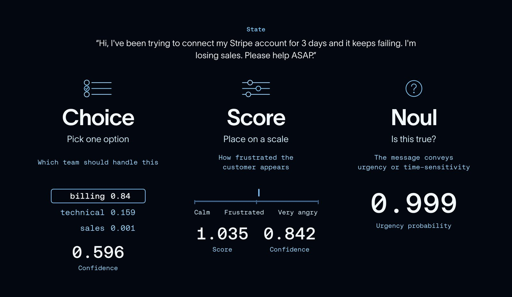

# JEV-as-a-Judge: Accept When Confident, Escalate When Unsure

> **Paper:** Yubo Li, Yidi Miao, Ramayya Krishnan, Rema Padman  
> **arXiv:** [2609.26550](https://arxiv.org/abs/2609.26550)  
> **Version:** v3, 29 September 2026  
> **Presentation target:** ~15 minutes
>
> **แก่นของ paper:** แทนที่จะใช้ reasoning LLM ที่แพงเป็น judge กับทุกตัวอย่าง ให้ใช้ **JEV เป็น first-stage judge** ที่ตัดสินอย่างรวดเร็วและคืน probability จากนั้นใช้ **confidence** เป็น gate: ถ้ามั่นใจก็จบที่ JEV แต่ถ้าไม่มั่นใจก็ส่งต่อให้ reasoning LLM เช่น GPT-6

---

# 1. TL;DR

ปัญหาหลักของ **LLM-as-a-Judge** คือเมื่อ evaluation มีจำนวนมาก การใช้ reasoning LLM ทุกครั้งมีทั้ง **ค่าใช้จ่ายและ latency สูง** และเรายังต้องการ judge ที่บอกได้ว่า *case ไหนควรให้ stronger model ช่วยตัดสิน*

Paper นี้จึงศึกษาการใช้ **TypeSafe JEV** ซึ่งเป็น **decision-only judge**:

```text
Input
  │
  ▼
JEV
  │
  ├── verdict
  └── probability ของแต่ละ label
          │
          ▼
     confidence q
          │
      q >= τ ?
       /     \
     yes      no
      │        │
      ▼        ▼
   Accept    GPT-6
              │
              ▼
         Final verdict
```

โดยสรุปคือ **JEV ไม่จำเป็นต้องตัดสินใจให้ถูกทุกข้อ แต่ต้องรู้ว่าข้อไหนตัวเองไม่ควรตัดสิน**

ผลหลักของ paper:

- JEV มี accuracy ใกล้ GPT-6 ในงานที่ verdict สามารถ **อ่านออกจากข้อความโดยตรง**
- JEV มีค่าใช้จ่ายประมาณ **$0.044 / 1,000 judgments** และ median latency **0.15 s** ใน timing panel
- GPT-6 อยู่ที่ประมาณ **$12.182 / 1,000 judgments** และ **1.89 s**
- JEV จึงถูกกว่าประมาณ **277×** และเร็วกว่าใน median latencyประมาณ **13×** ใน workload/timing panel นี้
- จุดอ่อนของ JEV อยู่ในงานที่ต้อง **derive/check reasoning** เช่น math, code, logic
- confidence มีประโยชน์ในการบอกว่า JEV ผิดตรงไหน: เมื่อ `q >= 0.9` JEV และ GPT-6 มี accuracy ใกล้กันมาก
- cascade `JEV → GPT-6` บน held-out preference pairs 1,610 คู่ ทำได้ **93.4% vs GPT-6 92.5%** โดยใช้ fee ประมาณ **41.4%** ของ GPT-6
- ใน prospective test บน workload ใหม่ 570 คู่ cascade ทำ accuracy **90.2% เท่ากับ GPT-6** และใช้ fee **75.5%** หรือประหยัดประมาณ 24.5%


---

# 2. ปัญหาของ paper นี้คืออะไร?

## LLM-as-a-Judge ดีแต่แพงเมื่อต้อง scale

การประเมิน LLM แบบ open-ended มีปัญหาว่า metric แบบดั้งเดิม เช่น BLEU ไม่สามารถบอกคุณภาพได้ดีเมื่อไม่มี reference answer ที่ชัดเจน

จึงเกิดแนวคิด **LLM-as-a-Judge**:

```text
Candidate Answer
       │
       ▼
   LLM Judge
       │
       ├── reasoning
       ├── explanation
       └── verdict
```

ข้อดีคือ judge สามารถเข้าใจ rubric ใหม่ ๆ ได้ **แต่ถ้า evaluation มีเป็นแสนหรือเป็นล้านรายการ การใช้ reasoning model ทุกครั้งมีต้นทุนสูงมาก**

Paper รายงานว่า GPT-6 ใน timing panel มีค่าใช้จ่ายประมาณ:

```text
$12.182 / 1,000 judgments
≈ $12,182 / 1 million judgments
```

และยังมี latency จาก inference + network + provider + retry

ดังนั้นโจทย์ของ paper ไม่ใช่

> “สร้าง judge ที่ accuracy สูงกว่า GPT-6”

แต่คือ

> **“เราสามารถใช้ judge ที่ถูกและเร็วเป็น first pass แล้วให้มันรู้ตัวเมื่อควรส่งต่อให้ stronger judge ได้หรือไม่?”**

---

# 3. แนวคิดของ paper นี้

## 3.1 System One Model

JEV เป็น decision model ของ TypeSafe ที่ paper ใช้ผ่าน **TypeSafe JEV 1.13.0**

แนวคิดต่างจาก generative LLM คือ output ที่ต้องการไม่ใช่ข้อความยาว ๆ แต่เป็น **typed decision**



เช่นให้เลือกจาก choice (Choice mode):

```text
A / B / C (max 255 choices)
```

JEV สามารถคืน:

```text
A: 0.91
B: 0.06
C: 0.03

verdict = A
```

หรือ binary decision (Noul mode):

```text
Yes: 0.93
No:  0.07
```

หรือ ordered score (Score mode):

```text
Bad:     0.02
Accept:  0.88
Excellent: 0.10
```

Paper ระบุ output types หลักของ JEV คือ:

- **Choice** — probability ของ labels ที่กำหนด
- **Noul** — yes/no probability
- **Score** — probability ของระดับ score แบบ ordered

ใน experiment หลักใช้ `Choice`

---

## 3.2 TypeSafe JEV

คำว่า **TypeSafe** สำคัญ เพราะ output ถูกกำหนด type ไว้ตั้งแต่ต้น

แทนที่จะบอก LLM:

```text
Please analyze the answer and explain why
```

แล้วพยายาม parse text เพื่อหา verdict

จะกำหนด contract ว่า:

```text
Allowed labels:
- A
- B
- C

Return:
- verdict
- probability for each label
```

ดังนั้น downstream application สามารถใช้ output ได้โดยตรง

### จุดสำคัญเรื่องความเร็ว

ไม่ควรสรุปว่า:

> JEV เร็วเพราะ “มี parameter น้อยกว่า LLM”

เพราะ paper ไม่ได้ทำ compute-matched architectural comparison เพื่อพิสูจน์สาเหตุนี้

สิ่งที่ paper วัดได้คือ **operational difference**:

1. JEV เป็น decision-only interface
2. ไม่ต้อง generate rationale
3. output ถูกจำกัดเป็น typed decision + probabilities
4. ใน timing panel JEV มี latency/cost ต่ำกว่าหลาย generative judges อย่างมาก

ดังนั้น paper สนับสนุนข้อสรุปว่า **JEV เหมาะกับ decision workload ที่ต้องการ output สั้นและ structured** มากกว่าการอ้างว่า architecture เพียงอย่างเดียวเป็นสาเหตุของความเร็ว

---

## 3.3 LLM Judge vs JEV

| | Generative LLM Judge | JEV |
|---|---|---|
| Input | rubric + candidate | instructions + structured state |
| Output | text / rationale / verdict | typed verdict + probabilities |
| Reasoning text | สามารถ generate ได้ | ไม่มี generated text |
| Output format | ต้อง constrain/parse | typed contract |
| Confidence | มักเป็น probability ที่ model verbalize | probability distribution ของ decision |
| Cost | สูงกว่าใน timing panel | ต่ำมาก |
| Latency | สูงกว่าใน timing panel | ต่ำ |
| เหมาะกับ | reasoning / open-ended analysis | fast decision / classification / routing |
| จุดอ่อน | cost/latency | reasoning-heavy cases |

**ข้อสังเกตของ paper:** เพื่อให้เปรียบเทียบกันได้ generative judges ใน benchmark ก็ถูกบังคับให้ตอบภายใต้ **decision + probability contract** และไม่มี rationale เช่นกัน ดังนั้น benchmark นี้เปรียบเทียบ “ความสามารถในการตัดสิน” มากกว่าความสามารถในการเขียน explanation

---

## Figure 1 จาก paper: ภาพรวมแนวคิด


**อธิบายรูป:** paper วางวิวัฒนาการของ evaluation เป็น 3 ขั้น:

1. Human judge — ใช้ expertise สูง แต่ scale ยาก
2. LLM-as-a-Judge — scale ได้ และสามารถสร้าง rationale
3. JEV-as-a-Judge — คืน **decision + confidence** เพื่อให้ระบบนำไป route ต่อได้

รูปนี้เป็น figure ต้นฉบับจาก HTML ของ paper

---

# 4. Benchmark

## 4.1 Datasets: มีกี่ dataset และทำอะไรกับมัน?

Paper ใช้ **3 base public workloads หลัก** และมี follow-up datasets / workloads เพิ่มเติม

### Base benchmarks

| Dataset | จำนวน | สิ่งที่วัด |
|---|---:|---|
| **RewardBench** | 1,500 pairs | pairwise preference |
| **JudgeBench** | 350 pairs | objective correctness เช่น knowledge, reasoning, math, code |
| **HaluEval** | 3,000 answers | evidence-grounded factuality / hallucination |
| **Final-answer set** | 150 | final answer ถูก/ผิด/no-answer |

รวม base judgments:

**5,172 items**

โดย preference pairs จะถูกทดสอบทั้ง **original order และ reversed order** ใน diagnostics

### Follow-up

นอกจากนี้ paper ยังทดสอบ:

- **RewardBench 2** — four-way selection
- **RM-Bench** — 500 prompts × หลาย style combinations
- **Natural prose** — grounded summaries และ reference-free responses
- **Answer-format experiment**
- **GSM8K / synthetic evidence controls**
- **Prospective test** — PPE + JudgeBench Claude split รวม 570 held-out pairs

### Human adjudication

มี blinded human adjudication ใน subset ของ benchmark เพื่อดูว่า benchmark labels เองอาจผิดหรือไม่

Paper รายงาน targeted adjudication รวม **183 items** ใน final analysis จาก original 990-item disagreement subset

---

## 4.2 Metrics: มีอะไรบ้าง?

Paper ไม่ได้วัดแค่ accuracy เพราะถ้าจะใช้ JEV เป็น routing model เราต้องรู้ด้วยว่า **probability ของมันมีความหมายหรือไม่**

### 1. Accuracy

\[
Accuracy =
\frac{\text{จำนวน prediction ที่ถูก}}
{\text{จำนวน prediction ทั้งหมด}}
\]

ใช้ตอบ:

> Judge ตัดสินตรงกับ benchmark label กี่เปอร์เซ็นต์?

---

### 2. Macro-F1

ใช้กับ final-answer set ที่มีหลาย class

\[
F1 = \frac{2PR}{P+R}
\]

แล้วเฉลี่ย F1 ของแต่ละ class:

\[
MacroF1 = \frac{1}{K}\sum_{k=1}^{K}F1_k
\]

ใช้เพื่อลดปัญหาที่ class distribution ไม่สมดุล

---

### 3. Multiclass Brier Score

ใช้วัด **คุณภาพของ probability**

สำหรับ multiclass:

\[
Brier =
\frac{1}{N}
\sum_{i=1}^{N}
\sum_{k=1}^{K}
(p_{ik}-y_{ik})^2
\]

โดย:

- \(p_{ik}\) = probability ที่ model ให้ class \(k\)
- \(y_{ik}\) = 1 ถ้า class \(k\) เป็นคำตอบจริง ไม่เช่นนั้น 0

**ยิ่งต่ำยิ่งดี**

ตัวอย่าง:

```text
ถูก + confidence 0.95
→ penalty ต่ำ

ผิด + confidence 0.99
→ penalty สูง
```

ดังนั้น Brier สามารถจับกรณี **“มั่นใจมากแต่ผิด”** ได้ดีกว่า accuracy

---

### 4. Negative Log-Likelihood (NLL)

\[
NLL =
-\frac{1}{N}
\sum_{i=1}^{N}
\log p(y_i|x_i)
\]

**ยิ่งต่ำยิ่งดี**

ถ้า model ให้ probability ต่ำมากกับคำตอบจริง จะถูกลงโทษหนัก

Paper ใช้ clipped NLL โดยกำหนด probability floor \(10^{-6}\)

---

### 5. Expected Calibration Error (ECE)

แบ่ง confidence เป็น bins เช่น:

```text
0.0–0.1
0.1–0.2
...
0.9–1.0
```

แล้ววัดความแตกต่างระหว่าง:

```text
confidence ที่ model บอก
vs
accuracy จริง
```

โดยทั่วไป:

\[
ECE =
\sum_{b=1}^{B}
\frac{|S_b|}{N}
|\text{acc}(S_b)-\text{conf}(S_b)|
\]

**ยิ่งต่ำยิ่งดี**

ตัวอย่าง:

```text
Model บอก confidence เฉลี่ย = 0.90
แต่ในกลุ่มนั้นถูกจริง = 0.60

→ calibration แย่
```

---

### 6. Error-detection AUROC

ในงาน cascade เราอยากรู้ว่า confidence สามารถบอกได้ไหมว่า:

```text
ถูก
vs
ผิด
```

Paper ใช้:

\[
score = 1-q
\]

เพื่อให้ **ค่ามาก = มีโอกาสผิดมาก**

จากนั้นคำนวณ AUROC

- 0.5 → แยก correct/error แทบไม่ได้
- 1.0 → แยกได้สมบูรณ์

---

### 7. Cost และ Latency

Paper ยังวัด:

- estimated USD / 1,000 judgments
- median latency
- p95 latency

Latency มาจาก matched timing panel และรวม network/provider/retry behavior ดังนั้นไม่ใช่ pure model inference time

---

# 5. Result: Benchmark

## 5.1 Accuracy หลัก

ผล base benchmark:

| Judge | RewardBench | JudgeBench | HaluEval | Final Answer |
|---|---:|---:|---:|---:|
| **JEV 1.13** | **92.5%** | 78.6% | 87.3% | 94.0% |
| **GPT-6 Astra** | **92.5%** | **93.1%** | **88.4%** | **96.7%** |

ดังนั้นภาพรวมคือ:

- RewardBench → ใกล้เคียงมาก
- HaluEval → ใกล้เคียง
- Final answer → JEV ตามเล็กน้อย
- JudgeBench → gap ใหญ่ เพราะเป็น correctness/reasoning-heavy

---

## กราฟ 1 — Cost

กราฟนี้ **reconstructed จากค่าที่ paper รายงานใน Table 1 / Figure 3** เพื่อให้อ่านง่ายใน Markdown; ไม่ใช่การ redraw จาก raw benchmark data


**อ่านกราฟ:**

JEV อยู่ต่ำกว่ากลุ่ม generative judges อย่างมาก:

- JEV: `$0.044 / 1K`
- GPT-4.1 mini: `$0.390 / 1K`
- GPT-6: `$12.182 / 1K`

ดังนั้น JEV มี cost ต่ำกว่า GPT-6 ประมาณ **277×** ใน timing panel นี้

---

## กราฟ 2 — Latency


**อ่านกราฟ:**

Median latency:

```text
JEV       0.15 s
GPT-4.1   0.58 s
GPT-5.4   1.44 s
GPT-5.6   1.74 s
GPT-6     1.89 s
```

JEV จึงเหมาะกับ evaluation ที่ต้องการ throughput สูงหรือ evaluation ที่อยู่ใน request path

> **หมายเหตุ:** paper ระบุชัดว่า latency นี้รวม network/provider/retry และไม่ได้หมายถึง intrinsic inference time

---

# 6. Benchmark บอกอะไรเกี่ยวกับ “ความยาก” ของงาน?

นี่คือหนึ่งใน insight สำคัญที่สุดของ paper

Paper แบ่งลักษณะของงานได้ประมาณ:

### งานที่ “อ่าน verdict ออกจาก text” ได้

ตัวอย่าง:

- chat quality
- safety refusal
- evidence-grounded factuality
- ordinary preference

JEV ใกล้ GPT-6 มาก

### งานที่ต้อง “derive/check” verdict

ตัวอย่าง:

- expert knowledge
- code
- math
- logic puzzles

JEV ตาม GPT-6 มากขึ้น

---

## กราฟ 3 — JEV − GPT-6 ตาม skill


**อ่านกราฟ:**

ความแตกต่างเด่นที่สุด:

```text
Logic puzzles     -27.6 pp
Math              -14.3 pp
Code              -12.9 pp
Expert knowledge   -7.0 pp
```

แต่ในงานที่ verdict อ่านได้ตรง ๆ:

```text
Evidence factuality  ≈ -1.1 pp
Safety               ≈ ใกล้เคียง
Chat quality         ≈ ใกล้เคียง
```

### Insight

> **สิ่งที่สำคัญไม่ใช่ “ข้อความยาวแค่ไหน” แต่คือ “judge ต้องทำอะไรกับข้อความนั้น”**

Paper พบว่าความยาวอย่างเดียวไม่ได้อธิบาย gap ได้ดี

---

## Difficulty ที่น่าสนใจ

Paper วัด difficulty โดยไม่ใช้ JEV/GPT-6:

> นับว่าจาก LLM judges อีก 13 ตัว มีทั้งหมดกี่ตัวที่ตัดสินผิด

ผล:

- ถ้า 13 judges ที่เหลือ **ถูกทั้งหมด** → JEV 99.8%, GPT-6 99.7%
- ถ้าเป็น item ที่ **ยากปานกลาง** → gap ระหว่าง JEV กับ GPT-6 ใหญ่ขึ้น
- ถ้ายากมากจนอย่างน้อย 10/13 judges ผิด → ทั้งคู่ลงไปประมาณ 9.6%

ดังนั้น JEV ไม่ได้แย่เพราะ “randomly wrong”

แต่ gap ส่วนใหญ่เกิดตรง:

> **medium-difficulty cases ที่ reasoning judge ยังสามารถแก้ได้ แต่ JEV เริ่มพลาด**

---

# 7. ค่า Confidence ใน JEV

นี่คือหัวใจของ paper

ให้ probability ที่ JEV คืนมาว่า:

```text
A = 0.91
B = 0.06
C = 0.03
```

กำหนด:

\[
q = \max_k p_k
\]

ดังนั้น:

\[
q = 0.91
\]

และใช้ \(q\) เป็น confidence

---

## Confidence สามารถบอกความถูกต้องได้หรือไม่?

ผล pooled public tasks:

- `q < 0.6` → JEV ถูกประมาณ **55.1%**
- `q = 1` → JEV ถูกประมาณ **97.8%**

ดังนั้น accuracy มีแนวโน้มสูงขึ้นตาม confidence


**สรุปจาก Figure 5:**

confidence ไม่ใช่แค่ตัวเลขประกอบ output แต่มี signal ว่า item นั้นง่ายหรือยาก

---

## Threshold 0.9

ถ้า:

\[
q \ge 0.9
\]

ให้ accept JEV

ถ้า:

\[
q < 0.9
\]

ให้ escalate

จาก public items:

```text
q >= 0.9
→ 3,744 items

q < 0.9
→ 1,106 items
```

ในกลุ่มที่ JEV มั่นใจ:

```text
JEV    = 94.7%
GPT-6  = 94.4%
```

แต่ในกลุ่ม low-confidence:

```text
JEV    = 67.7%
GPT-6  = 75.0%
```

จึงเกิดแนวคิด:

> **JEV ไม่จำเป็นต้องชนะ GPT-6; ขอเพียงรู้ว่าเมื่อไร GPT-6 ควรถูกเรียก**

---

# 8. Cascade Benchmark

ระบบจริงจึงกลายเป็น:

```text
             ┌─────────┐
Input ──────►│   JEV   │
             └────┬────┘
                  │
              confidence
                  │
          ┌───────┴───────┐
          │               │
       high q           low q
          │               │
          ▼               ▼
     JEV verdict        GPT-6
                          │
                          ▼
                    final verdict
```

## Held-out 1,610 pairs

Threshold ถูก freeze ก่อนดู held-out outcomes

ผล:

| | JEV | Cascade | GPT-6 |
|---|---:|---:|---:|
| Accuracy | 90.9% | **93.4%** | 92.5% |
| Escalated | — | **31.5%** | 100% |
| Fee ratio | — | **41.4%** | 100% |

กล่าวคือ:

> Cascade ใช้ GPT-6 เฉพาะส่วนที่ JEV ไม่มั่นใจ และได้ accuracy สูงกว่า GPT-6 baseline ใน held-out sample ขณะที่ใช้ fee เพียงประมาณ 41.4%

JEV ตัดสินเองประมาณ:

```text
68.5% ของ pairs
```

ส่วน low-confidence:

```text
31.5% → GPT-6
```

และกลุ่มที่ถูก escalate มีประมาณ **85% ของ JEV errors**

นี่คือหลักฐานว่าความมั่นใจของ JEV สามารถใช้เป็น routing signal ได้

---

# 9. Prospective Test: ทดสอบกับ workload ใหม่

การทดลองนี้สำคัญเพราะไม่ได้ใช้ workload เดิมทั้งหมด

ใช้ 2 workload ใหม่:

1. **PPE correctness**
2. **JudgeBench Claude split**

รวม:

```text
570 held-out pairs
```

ก่อนทดลอง:

- ใช้ 100 local selection labels ต่อ workload
- เลือก threshold ด้วย lower-confidence-bound rule
- จากนั้น freeze threshold
- แล้วจึงรัน held-out workload

ผล:

| Workload | JEV | Cascade | GPT-6 | Escalated | Fee |
|---|---:|---:|---:|---:|---:|
| PPE | 78.2% | **88.2%** | 88.2% | 67.8% | 69.3% |
| JudgeBench Claude | 70.9% | **94.7%** | 94.7% | 89.4% | 91.0% |
| **รวม** | 76.1% | **90.2%** | 90.2% | **74.2%** | **75.5%** |

### Insight ที่สำคัญมาก

เมื่อ workload ยากขึ้น:

```text
JEV ไม่ได้ฝืนตัดสินเอง
       ↓
confidence ต่ำลง
       ↓
escalate มากขึ้น
       ↓
accuracy กลับมาเท่า GPT-6
```

ดังนั้น system ไม่ได้มี fixed cost saving เช่น “ประหยัด 60% เสมอ”

แต่เป็น adaptive trade-off:

> **งานง่าย → JEV รับเองมาก → ประหยัดมาก**  
> **งานยาก → escalate มาก → ประหยัดน้อยลง แต่รักษา accuracy**

---

# 10. Applications

## 10.1 LLM Evaluation at Scale

ตัวอย่าง:

```text
1,000,000 model responses
          │
          ▼
        JEV
          │
    ┌─────┴─────┐
  easy         hard
    │             │
    ▼             ▼
 accept         GPT-6
```

เหมาะกับ:

- regression testing
- model checkpoint evaluation
- prompt evaluation
- A/B testing
- large-scale benchmark runs

---

## 10.2 RAG Evaluation

เช่น:

```text
Answer + Retrieved Evidence
             │
             ▼
            JEV
             │
       grounded?
```

เหมาะกับ criteria ที่ evidence อยู่ใน input และ verdict สามารถตรวจจาก evidence ได้

ตัวอย่าง:

- groundedness
- citation support
- factual consistency
- answer relevance

แต่ถ้าต้องตรวจ reasoning ซับซ้อน ควรมี fallback

---

## 10.3 Agent Evaluation

สามารถใช้กับ agent trajectory:

```text
Agent Trace
   │
   ├── tool calls
   ├── retrieved docs
   └── final answer
          │
          ▼
         JEV
          │
     ┌────┴────┐
   pass      unsure
     │          │
     ▼          ▼
  accept      LLM judge
```

เช่น:

- agent ทำ task สำเร็จหรือไม่
- เลือก tool ถูกหรือไม่
- evidence ถูกใช้หรือไม่
- final answer grounded หรือไม่
- policy compliance

---

## 10.4 Online / Continuous Evaluation

เพราะ JEV มี latency ต่ำกว่าใน timing panel จึงมีศักยภาพสำหรับ:

```text
Production request
       │
       ▼
      JEV
       │
   ┌───┴───┐
   │       │
 pass    uncertain
   │       │
   ▼       ▼
 store   async / strong judge
```

ช่วยลดการเรียก expensive judge ทุก request

---

# 11. Limitations

## 1. JEV ไม่ใช่ universal judge

งาน reasoning-heavy ยังมี gap ใหญ่ โดยเฉพาะ:

- logic
- math
- code
- expert knowledge

---

## 2. Confidence ไม่ใช่ correctness certificate

JEV สามารถ:

```text
confidence สูง
      +
wrong answer
```

ได้

โดยเฉพาะ **style-adversarial cases**

RM-Bench hard pairs:

- JEV error-detection AUROC ≈ **0.764**
- style-matched ≈ **0.839**

และ reference-free prose แย่กว่านั้นมาก:

```text
AUROC ≈ 0.498
```

แทบไม่ต่างจาก random

---

## 3. Dataset labels มี noise

Paper พบว่า HaluEval มีบาง labels ที่ evidence ไม่สนับสนุน label เดิม

ดังนั้น:

> benchmark accuracy ≠ ground-truth correctness เสมอไป

จึงมี human adjudication เพื่อ sensitivity analysis

---

## 4. ไม่ใช่ compute-matched comparison

JEV, GPT และ model อื่น ๆ:

- model size ต่างกัน
- reasoning effort ต่างกัน
- serving infrastructure ต่างกัน
- provider ต่างกัน

ดังนั้น paper ไม่สามารถสรุปเชิง causal ได้ว่า:

> “decision-only architecture ทำให้เร็วกว่าเสมอ”

สิ่งที่วัดได้คือ **operational performance ของ configuration ที่ทดลอง**

---

## 5. Threshold ต้อง validate ตาม workload

ไม่ควรตั้ง:

```text
τ = 0.9
```

แล้วใช้กับทุกงาน

Paper พบว่า threshold และ calibration เป็น **workload-dependent**

แนวทางคือ:

1. เอา labeled examples จาก target workload
2. รัน JEV + fallback
3. เลือก threshold
4. freeze threshold
5. ทดสอบบน held-out data

---

# 12. สรุปสำหรับปิด Presentation

Paper นี้ไม่ได้เสนอว่า:

> **“JEV ดีกว่า LLM Judge”**

แต่เสนอวิธีคิดใหม่ว่า:

> **“ไม่จำเป็นต้องใช้ expensive reasoning judge กับทุก case”**

และ architecture ของระบบคือ:

```text
                ┌─────────────┐
                │     JEV     │
                │ Fast Judge  │
                └──────┬──────┘
                       │
                 Confidence q
                       │
              ┌────────┴────────┐
              │                 │
          Confident          Uncertain
              │                 │
              ▼                 ▼
          Accept JEV          GPT-6
                                │
                                ▼
                          Final decision
```

### 3 สิ่งที่ควรจำ

**1. Decision-only**

JEV ไม่ได้พยายาม generate explanation แต่ตอบ decision + probability

**2. Confidence as routing signal**

confidence สามารถแยก easy cases จาก hard cases ได้ในหลาย workload

**3. Cascade**

JEV ทำหน้าที่เป็น **cheap first stage** ส่วน reasoning LLM เป็น **expensive fallback**

> **ดังนั้น innovation ที่สำคัญของ paper ไม่ใช่แค่ “JEV เร็วกว่า” แต่คือการเปลี่ยนจาก “เลือก judge ตัวเดียว” เป็น “ใช้ judge หลายระดับตามความยากของแต่ละ case”**

---

## References

- Li, Y., Miao, Y., Krishnan, R., & Padman, R. (2026). *JEV-as-a-Judge: Accept When Confident, Escalate When Unsure*. arXiv:2609.26550.
- Paper: https://arxiv.org/abs/2609.26550
- PDF: https://arxiv.org/pdf/2609.26550
- Project page: https://yubol-bobo.github.io/jev-as-a-judge/

### Figure note

- **Figure 1** ใช้ภาพต้นฉบับจาก HTML ของ paper
- กราฟ benchmark ที่มีคำว่า **“Reconstructed from paper”** สร้างใหม่จากค่าที่ paper รายงานใน Table/Figure เพื่อให้เหมาะกับการอ่านใน Markdown และ presentation โดยไม่ได้อ้างว่าเป็นภาพต้นฉบับของ figure นั้น
